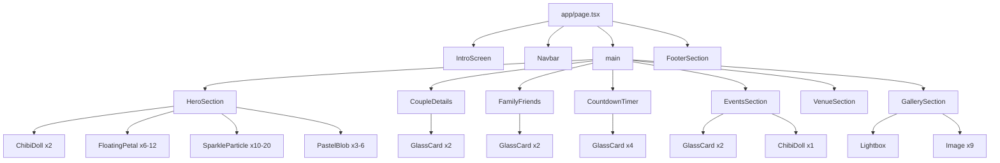
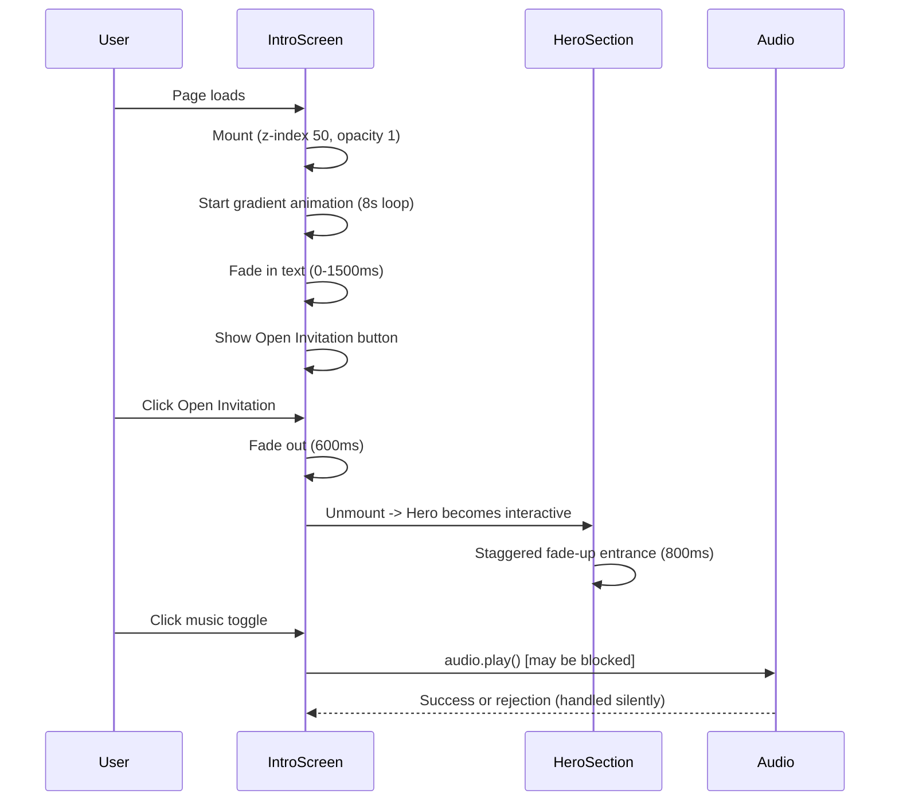
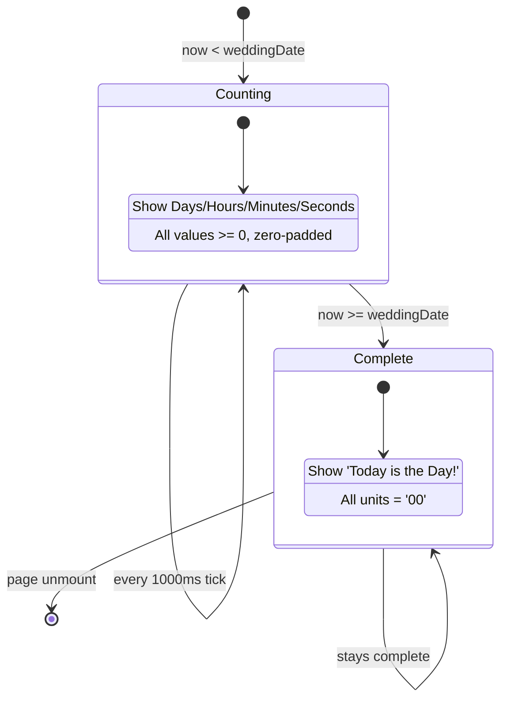
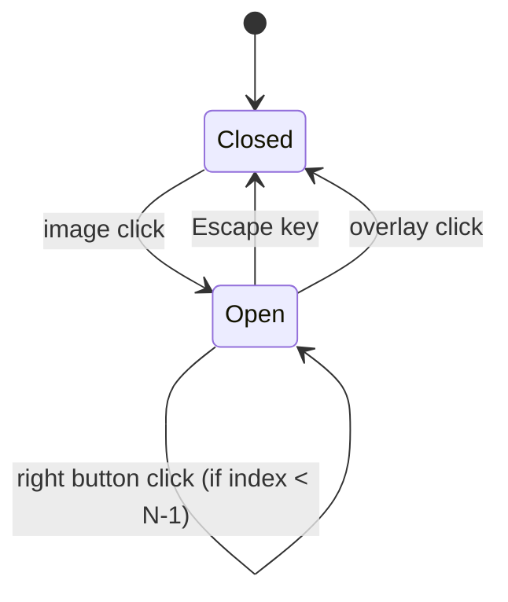

# Technical Design Document

## Korean Pastel Wedding Invitation Website

**Feature:** korean-pastel-wedding-invitation  
**Couple:** Ashmi SS (Bride) & Jeffrin J (Groom)  
**Wedding Date:** 11 November 2026  
**Stack:** Next.js 15, Tailwind CSS v4, Framer Motion (motion/react), Lucide React, Vercel  

---

## Overview

This document describes the technical architecture for a premium, fully responsive wedding invitation website for the wedding of Ashmi SS and Jeffrin J on 11 November 2026. The site uses a modern Korean pastel aesthetic: soft gradient backgrounds, glassmorphism cards, chibi-style doll illustrations, cinematic entrance animations, and a live countdown timer.

The site is a single-page application built with the Next.js 15 App Router. All content is statically generated at build time (no server-side data fetching required), making it ideal for Vercel edge deployment. Framer Motion (published as the `motion` package since 2025) drives all entrance and ambient animations. Tailwind CSS v4 handles all styling via CSS-first `@theme` configuration. Lucide React provides the icon set.

### Key Design Decisions

- **Static Site Generation (SSG):** All wedding data is hardcoded in a typed data layer (`src/data/`). No API routes or database are needed. `next build` produces a fully static export deployable to Vercel.
- **Single Page, Multi-Section:** The entire invitation lives on one page (`app/page.tsx`) with anchor-linked sections. This matches the WhatsApp sharing use case.
- **Client Components for Animation:** Sections with Framer Motion animations are marked `use client`. Static sections can remain Server Components.
- **motion/react over framer-motion:** The `framer-motion` package was renamed to `motion` in 2025. All imports use `motion/react`.
- **Tailwind v4 CSS-first config:** Theme tokens (colors, fonts, shadows) are defined in `src/app/globals.css` using the `@theme` directive.
- **Reduced Motion:** A custom `useReducedMotion` hook wraps Framer Motion's built-in hook to set all animation durations to 0ms when `prefers-reduced-motion: reduce` is active.
- **Chibi Dolls as SVG/PNG assets:** Placed in `public/illustrations/` and referenced via Next.js `Image` component with explicit width/height to prevent CLS.

---

## Architecture

### High-Level Architecture

```
Vercel Edge Network
       |
  Next.js 15 App Router (Static Export)
       |
  app/
  +-- layout.tsx          (root layout: fonts, metadata, global CSS)
  +-- page.tsx            (single page: assembles all sections)
       |
  src/
  +-- components/         (all UI components)
  |   +-- sections/       (full-page sections)
  |   +-- ui/             (reusable primitives)
  |   +-- animations/     (shared animation wrappers)
  +-- data/               (static typed content)
  +-- hooks/              (custom React hooks)
  +-- lib/                (utility functions)
  +-- types/              (TypeScript interfaces)
  public/
  +-- illustrations/      (chibi doll SVG/PNG assets)
  +-- audio/              (background music file)
  +-- images/             (gallery placeholder images)
```

### Rendering Strategy

| Layer | Strategy | Reason |
|-------|----------|--------|
| Page shell | Server Component | No interactivity needed at layout level |
| Intro Screen | Client Component | Requires state (open/closed, music toggle) |
| Navbar | Client Component | Requires scroll listener and mobile menu state |
| Hero Section | Client Component | Framer Motion viewport animations |
| Couple Details | Client Component | Slide-in viewport animations |
| Family & Friends | Client Component | Scale-in viewport animations |
| Countdown Timer | Client Component | setInterval for live updates |
| Events Section | Client Component | Hover animations, viewport entrance |
| Venue Section | Client Component | Viewport entrance animation |
| Gallery Section | Client Component | Lightbox state, keyboard events |
| Footer | Client Component | Floating heart animations |

### Data Flow

```
src/data/wedding.ts  -->  Section Components  -->  Rendered HTML
     (static typed         (read-only props)       (no runtime fetch)
      content)
```

All content (names, dates, venues, family members) is imported from `src/data/wedding.ts` as typed constants. Components receive this data as props. There is no runtime data fetching, no API calls, and no database.

---

## Components and Interfaces

### Project Folder Layout

```
d:/sis_invitation/
├── app/
│   ├── layout.tsx                  # Root layout: Google Fonts, metadata, global CSS
│   ├── page.tsx                    # Single page: assembles all section components
│   └── globals.css                 # Tailwind v4 @theme tokens + base styles
├── src/
│   ├── components/
│   │   ├── sections/
│   │   │   ├── IntroScreen.tsx     # Full-viewport cinematic opening overlay
│   │   │   ├── HeroSection.tsx     # Couple names, date, chibi dolls
│   │   │   ├── CoupleDetails.tsx   # Bride & groom family info cards
│   │   │   ├── FamilyFriends.tsx   # Sisters / family member cards
│   │   │   ├── CountdownTimer.tsx  # Live countdown to wedding date
│   │   │   ├── EventsSection.tsx   # Engagement & Wedding event cards
│   │   │   ├── VenueSection.tsx    # Map embed + directions button
│   │   │   ├── GallerySection.tsx  # Masonry photo grid + lightbox
│   │   │   └── FooterSection.tsx   # Closing message + hearts animation
│   │   ├── ui/
│   │   │   ├── GlassCard.tsx       # Reusable glassmorphism card wrapper
│   │   │   ├── FloatingPetal.tsx   # Single animated petal element
│   │   │   ├── SparkleParticle.tsx # Single animated sparkle element
│   │   │   ├── PastelBlob.tsx      # Blurred background blob decoration
│   │   │   ├── FloralDivider.tsx   # SVG floral border between sections
│   │   │   ├── ChibiDoll.tsx       # Chibi illustration wrapper component
│   │   │   ├── Lightbox.tsx        # Full-screen image preview overlay
│   │   │   └── Navbar.tsx          # Sticky glassmorphism navigation bar
│   │   └── animations/
│   │       ├── FadeUp.tsx          # Reusable fade-up entrance wrapper
│   │       ├── SlideIn.tsx         # Reusable slide-in entrance wrapper
│   │       └── BounceIn.tsx        # Reusable bounce-in entrance wrapper
│   ├── data/
│   │   └── wedding.ts              # All static wedding content (typed)
│   ├── hooks/
│   │   ├── useCountdown.ts         # Countdown timer logic
│   │   ├── useReducedMotion.ts     # Wraps motion useReducedMotion
│   │   ├── useScrollY.ts           # Tracks scroll position for navbar
│   │   └── useAudio.ts             # Background music toggle logic
│   ├── lib/
│   │   ├── countdown.ts            # Pure countdown calculation function
│   │   └── animations.ts           # Shared Framer Motion variant definitions
│   └── types/
│       └── wedding.ts              # TypeScript interfaces for all data shapes
├── public/
│   ├── illustrations/
│   │   ├── bride-chibi.png         # Bride chibi doll illustration
│   │   └── groom-chibi.png         # Groom chibi doll illustration
│   ├── audio/
│   │   └── background-music.mp3    # Soft instrumental background audio
│   └── images/
│       └── gallery/                # 9 placeholder gallery images
├── next.config.ts                  # Next.js config (static export, image domains)
├── tailwind.config.ts              # Minimal config (v4 uses globals.css @theme)
└── tsconfig.json
```

### Component Interfaces

#### GlassCard

```typescript
interface GlassCardProps {
  children: React.ReactNode;
  className?: string;
  // Tailwind color token for border, e.g. 'border-pastel-lavender'
  borderColor?: string;
  // Backdrop blur intensity: 'sm' (8px) | 'md' (12px) | 'lg' (16px)
  blur?: 'sm' | 'md' | 'lg';
  // Whether to apply hover lift animation
  hoverable?: boolean;
}
```

#### FloatingPetal

```typescript
interface FloatingPetalProps {
  // Initial position as percentage of container
  initialX: number;
  initialY: number;
  // Animation duration in seconds (set to 0 when reduced motion)
  duration: number;
  // Delay before animation starts in seconds
  delay: number;
  // Pastel color from palette
  color: PastelColor;
  size: 'sm' | 'md' | 'lg';
}
```

#### SparkleParticle

```typescript
interface SparkleParticleProps {
  x: number;          // Position % within container
  y: number;
  delay: number;      // ms, randomized 0-3000
  duration: number;   // seconds for pulse cycle
  color: PastelColor;
}
```

#### ChibiDoll

```typescript
interface ChibiDollProps {
  variant: 'bride' | 'groom';
  // Max height in px (responsive: 120 desktop, 80 mobile)
  maxHeight?: number;
  className?: string;
  // Outline color from palette for drop-shadow filter
  outlineColor?: string;
}
```

#### Lightbox

```typescript
interface LightboxProps {
  images: GalleryImage[];
  initialIndex: number;
  isOpen: boolean;
  onClose: () => void;
}

interface GalleryImage {
  src: string;
  alt: string;
  category: 'couple portrait' | 'pre-wedding shoot' | 'family moment';
  width: number;
  height: number;
}
```

#### Navbar

```typescript
interface NavLink {
  label: string;   // Display text
  href: string;    // Anchor target, e.g. '#events'
}

// NavLinks constant (defined in data/wedding.ts):
// [Home, Story, Events, Venue, Gallery, Family]
```

#### FadeUp / SlideIn / BounceIn Animation Wrappers

```typescript
interface AnimationWrapperProps {
  children: React.ReactNode;
  delay?: number;       // seconds
  duration?: number;    // seconds (overridden to 0 when reduced motion)
  className?: string;
  // For SlideIn: direction of entry
  direction?: 'left' | 'right' | 'up' | 'down';
  // For BounceIn: stagger index for sequential children
  staggerIndex?: number;
}
```

#### CountdownTimer

```typescript
interface CountdownUnit {
  label: 'Days' | 'Hours' | 'Minutes' | 'Seconds';
  value: string;  // Zero-padded two-digit string, e.g. '07'
}

interface CountdownState {
  units: CountdownUnit[];
  isComplete: boolean;  // true when target date has passed
}
```

---

## Data Models

### TypeScript Interfaces (`src/types/wedding.ts`)

```typescript
// Pastel color palette tokens
export type PastelColor =
  | 'blush-pink'    // #f8d7e3
  | 'lavender'      // #d8c8f2
  | 'ivory'         // #fffaf2
  | 'soft-peach'    // #ffd8c2
  | 'light-gold';   // #f6d37a

export interface Person {
  name: string;
  qualification?: string;
  parents?: string;
  address?: string;
  role: string;  // e.g. 'Bride', 'Groom', 'Sister of the Bride'
}

export interface WeddingEvent {
  id: string;
  title: string;
  date: string;
  time: string;
  venue: string;
  iconName: string;  // Lucide icon name, e.g. 'Ring', 'Heart'
}

export interface GalleryImage {
  src: string;
  alt: string;
  category: 'couple portrait' | 'pre-wedding shoot' | 'family moment';
  width: number;
  height: number;
  blurDataURL?: string;  // Base64 blur placeholder for Next.js Image
}

export interface NavLink {
  label: string;
  href: string;
}

export interface WeddingData {
  bride: Person;
  groom: Person;
  weddingDate: string;       // ISO 8601: '2026-11-11T10:30:00+05:30'
  weddingDateDisplay: string; // '11 November 2026 | Wednesday'
  weddingTimeDisplay: string; // '10:30 AM - 11:30 AM'
  venue: string;
  mapsUrl: string;
  events: WeddingEvent[];
  familyMembers: Person[];
  gallery: GalleryImage[];
  navLinks: NavLink[];
}
```

### Static Data (`src/data/wedding.ts`)

```typescript
import type { WeddingData } from '@/types/wedding';

export const weddingData: WeddingData = {
  bride: {
    name: 'Ashmi SS',
    qualification: 'M.Sc., B.Ed',
    parents: 'A Siva Kumar & D Santhi',
    address: 'South Kaliyadappu, Sasthankarai, Colachel (P.O)',
    role: 'Bride',
  },
  groom: {
    name: 'Jeffrin J',
    qualification: 'B.Tech',
    parents: 'Javin Amaladhas & Raja Kumari',
    address: 'Kodumutty, Bethelpuram',
    role: 'Groom',
  },
  weddingDate: '2026-11-11T10:30:00+05:30',
  weddingDateDisplay: '11 November 2026 | Wednesday',
  weddingTimeDisplay: '10:30 AM - 11:30 AM',
  venue: 'Jannaki Ammal Thirumanamandapam, Colachel',
  mapsUrl: 'https://www.google.com/maps/dir/?api=1&destination=Jannaki+Ammal+Thirumanamandapam+Colachel',
  events: [
    {
      id: 'engagement',
      title: 'Engagement & Reception',
      date: '10 November 2026',
      time: '4:00 PM',
      venue: 'Jannaki Ammal Thirumanamandapam, Colachel',
      iconName: 'Gem',
    },
    {
      id: 'wedding',
      title: 'Wedding Ceremony',
      date: '11 November 2026',
      time: '10:30 AM - 11:30 AM',
      venue: 'Jannaki Ammal Thirumanamandapam, Colachel',
      iconName: 'Heart',
    },
  ],
  familyMembers: [
    { name: 'Ashika SS', role: 'Sister of the Bride' },
    { name: 'Jershiha', role: 'Sister of the Groom' },
  ],
  gallery: [
    // 3 couple portrait, 3 pre-wedding shoot, 3 family moment
    // Populated with placeholder images from public/images/gallery/
    { src: '/images/gallery/couple-1.jpg', alt: 'couple portrait', category: 'couple portrait', width: 600, height: 800 },
    { src: '/images/gallery/couple-2.jpg', alt: 'couple portrait', category: 'couple portrait', width: 600, height: 900 },
    { src: '/images/gallery/couple-3.jpg', alt: 'couple portrait', category: 'couple portrait', width: 600, height: 750 },
    { src: '/images/gallery/prewedding-1.jpg', alt: 'pre-wedding shoot', category: 'pre-wedding shoot', width: 600, height: 800 },
    { src: '/images/gallery/prewedding-2.jpg', alt: 'pre-wedding shoot', category: 'pre-wedding shoot', width: 600, height: 700 },
    { src: '/images/gallery/prewedding-3.jpg', alt: 'pre-wedding shoot', category: 'pre-wedding shoot', width: 600, height: 850 },
    { src: '/images/gallery/family-1.jpg', alt: 'family moment', category: 'family moment', width: 600, height: 800 },
    { src: '/images/gallery/family-2.jpg', alt: 'family moment', category: 'family moment', width: 600, height: 750 },
    { src: '/images/gallery/family-3.jpg', alt: 'family moment', category: 'family moment', width: 600, height: 900 },
  ],
  navLinks: [
    { label: 'Home', href: '#home' },
    { label: 'Story', href: '#story' },
    { label: 'Events', href: '#events' },
    { label: 'Venue', href: '#venue' },
    { label: 'Gallery', href: '#gallery' },
    { label: 'Family', href: '#family' },
  ],
};
```

### Countdown Calculation (`src/lib/countdown.ts`)

```typescript
export interface CountdownResult {
  days: string;     // Zero-padded, e.g. '07'
  hours: string;
  minutes: string;
  seconds: string;
  isComplete: boolean;
}

/**
 * Pure function: calculates countdown from now to targetDate.
 * Returns isComplete=true and all '00' values when target has passed.
 * Never returns negative values.
 */
export function calculateCountdown(
  targetDate: Date,
  now: Date = new Date()
): CountdownResult {
  const diff = targetDate.getTime() - now.getTime();
  if (diff <= 0) {
    return { days: '00', hours: '00', minutes: '00', seconds: '00', isComplete: true };
  }
  const days = Math.floor(diff / (1000 * 60 * 60 * 24));
  const hours = Math.floor((diff % (1000 * 60 * 60 * 24)) / (1000 * 60 * 60));
  const minutes = Math.floor((diff % (1000 * 60 * 60)) / (1000 * 60));
  const seconds = Math.floor((diff % (1000 * 60)) / 1000);
  const pad = (n: number) => String(n).padStart(2, '0');
  return {
    days: pad(days),
    hours: pad(hours),
    minutes: pad(minutes),
    seconds: pad(seconds),
    isComplete: false,
  };
}
```

---

---

## Page Layout and Routing

### Root Layout (`app/layout.tsx`)

```typescript
// Server Component
// Loads Google Fonts via next/font/google with display: swap
// Sets metadata: title, description, og:image, viewport
// Wraps children in <html> and <body> with font class names

import { Great_Vibes, Playfair_Display, Poppins } from 'next/font/google';

const greatVibes = Great_Vibes({
  weight: ['400'],
  subsets: ['latin'],
  display: 'swap',
  variable: '--font-great-vibes',
});

const playfair = Playfair_Display({
  weight: ['400', '700'],
  subsets: ['latin'],
  display: 'swap',
  variable: '--font-playfair',
});

const poppins = Poppins({
  weight: ['300', '400', '600'],
  subsets: ['latin'],
  display: 'swap',
  variable: '--font-poppins',
});
```

### Page Assembly (`app/page.tsx`)

```typescript
// Server Component - assembles all sections
// Sections are wrapped in <main> with semantic <section> elements
// Each section has an id matching the navbar anchor href

export default function WeddingPage() {
  return (
    <>
      <IntroScreen />
      <Navbar />
      <main>
        <section id='home'>   <HeroSection />      </section>
        <FloralDivider />
        <section id='story'>  <CoupleDetails />    </section>
        <FloralDivider />
        <section id='family'> <FamilyFriends />    </section>
        <FloralDivider />
        <section id='events'> <CountdownTimer />   </section>
        <section id='events'> <EventsSection />    </section>
        <FloralDivider />
        <section id='venue'>  <VenueSection />     </section>
        <FloralDivider />
        <section id='gallery'><GallerySection />   </section>
      </main>
      <footer>
        <FooterSection />
      </footer>
    </>
  );
}
```

### Semantic HTML Landmark Structure

The page uses the following landmark elements to satisfy Requirement 14.5:

| Element | Count | Purpose |
|---------|-------|---------|
| `<header>` | 1 | Inside Navbar component |
| `<nav>` | 1 | Inside Navbar component |
| `<main>` | 1 | Wraps all content sections |
| `<section>` | 7 | home, story, family, countdown, events, venue, gallery |
| `<footer>` | 1 | FooterSection wrapper |

### Scroll Behavior

Smooth scrolling is implemented via CSS `scroll-behavior: smooth` on the `<html>` element, combined with anchor `href` links in the Navbar. This avoids JavaScript scroll libraries and works with keyboard navigation. The 600ms scroll duration is achieved via CSS `scroll-behavior: smooth` which browsers implement natively.

---

## Animation System Design

### Animation Library

All animations use the `motion` package (formerly `framer-motion`). Import path: `motion/react`.

```typescript
import { motion, AnimatePresence, useInView, useReducedMotion } from 'motion/react';
```

### Reduced Motion Strategy

A custom hook wraps Framer Motion's `useReducedMotion` to provide a duration multiplier:

```typescript
// src/hooks/useReducedMotion.ts
import { useReducedMotion as useFramerReducedMotion } from 'motion/react';

export function useReducedMotion() {
  const prefersReduced = useFramerReducedMotion();
  // When reduced motion is preferred, all durations become 0
  const durationMultiplier = prefersReduced ? 0 : 1;
  return { prefersReduced, durationMultiplier };
}
```

All animation components consume this hook and multiply their duration by `durationMultiplier`.

### Shared Animation Variants (`src/lib/animations.ts`)

```typescript
import type { Variants } from 'motion/react';

// Fade-up entrance: used for hero text, event cards, venue card
export const fadeUpVariants: Variants = {
  hidden: { opacity: 0, y: 20 },
  visible: (duration = 0.8) => ({
    opacity: 1,
    y: 0,
    transition: { duration, ease: 'easeOut' },
  }),
};

// Slide-in from left: used for bride card
export const slideInLeftVariants: Variants = {
  hidden: { opacity: 0, x: -40 },
  visible: {
    opacity: 1,
    x: 0,
    transition: { duration: 0.7, ease: 'easeOut' },
  },
};

// Slide-in from right: used for groom card
export const slideInRightVariants: Variants = {
  hidden: { opacity: 0, x: 40 },
  visible: {
    opacity: 1,
    x: 0,
    transition: { duration: 0.7, ease: 'easeOut' },
  },
};

// Bounce-in: used for countdown timer cards
export const bounceInVariants: Variants = {
  hidden: { opacity: 0, scale: 0 },
  visible: {
    opacity: 1,
    scale: 1,
    transition: {
      type: 'spring',
      stiffness: 300,
      damping: 15,
      // Produces scale 0 -> 1.1 -> 1.0 overshoot naturally
    },
  },
};

// Scale-in: used for family cards
export const scaleInVariants: Variants = {
  hidden: { opacity: 0, scale: 0.95 },
  visible: {
    opacity: 1,
    scale: 1,
    transition: { duration: 0.5, ease: 'easeOut' },
  },
};

// Stagger container: wraps staggered children
export const staggerContainerVariants: Variants = {
  hidden: {},
  visible: {
    transition: {
      staggerChildren: 0.15,  // 150ms stagger for hero elements
    },
  },
};

// Countdown stagger: 100ms between cards
export const countdownStaggerVariants: Variants = {
  hidden: {},
  visible: {
    transition: { staggerChildren: 0.1 },
  },
};
```

### Viewport Entry Pattern

All section entrance animations use `useInView` with `once: true` to trigger only on first entry:

```typescript
// Pattern used in all section components
const ref = useRef(null);
const isInView = useInView(ref, { once: true, margin: '-20% 0px' });

return (
  <motion.div
    ref={ref}
    variants={fadeUpVariants}
    initial='hidden'
    animate={isInView ? 'visible' : 'hidden'}
  >
    {children}
  </motion.div>
);
```

### Ambient Animation System

Floating petals, sparkles, and blobs use CSS keyframe animations (not Framer Motion) for performance. They are defined in `globals.css` and applied via Tailwind utility classes. This keeps the React component tree lean.

```css
/* globals.css - ambient animations */
@keyframes float-petal {
  0%, 100% { transform: translateY(0) rotate(0deg); }
  50% { transform: translateY(-20px) rotate(15deg); }
}

@keyframes sparkle-pulse {
  0%, 100% { transform: scale(1); opacity: 0.8; }
  50% { transform: scale(1.4); opacity: 1; }
}

@keyframes blob-drift {
  0%, 100% { transform: translate(0, 0) scale(1); }
  33% { transform: translate(20px, -15px) scale(1.05); }
  66% { transform: translate(-10px, 10px) scale(0.95); }
}

/* Reduced motion: all ambient animations become static */
@media (prefers-reduced-motion: reduce) {
  .animate-float-petal,
  .animate-sparkle,
  .animate-blob {
    animation: none;
  }
}
```

**Performance rule:** Ambient elements use only `transform` and `opacity` in their keyframes, never `top`, `left`, `width`, `height`, `margin`, or `padding`. This keeps animations on the GPU compositor thread.

### Intro Screen Animation Sequence

```
t=0ms    Page loads -> IntroScreen mounts, z-index: 50
t=0ms    Background gradient animation starts (8s loop)
t=0ms    Petals and sparkles begin floating
t=300ms  Text 'Together with their families' fades in (opacity 0->1, 1200ms)
t=600ms  Text 'invite you to celebrate' fades in (opacity 0->1, 900ms)
t=800ms  'Open Invitation' button fades in
         [User clicks button]
t+0ms    IntroScreen begins fade-out (opacity 1->0, 600ms)
t+600ms  IntroScreen unmounts via AnimatePresence, Hero becomes interactive
```

### Lightbox Animation

```typescript
// AnimatePresence wraps the lightbox for mount/unmount animations
<AnimatePresence>
  {isOpen && (
    <motion.div
      className='fixed inset-0 z-50'
      initial={{ opacity: 0 }}
      animate={{ opacity: 0.85 }}
      exit={{ opacity: 0 }}
      transition={{ duration: 0.3 }}
    >
      {/* overlay */}
    </motion.div>
  )}
</AnimatePresence>
```

---

## Styling System

### Tailwind CSS v4 Configuration

Tailwind v4 uses a CSS-first approach. All theme tokens are defined in `src/app/globals.css` using the `@theme` directive. No `tailwind.config.js` color/font configuration is needed.

```css
/* src/app/globals.css */
@import 'tailwindcss';

@theme {
  /* Pastel Color Palette */
  --color-pastel-blush: #f8d7e3;
  --color-pastel-lavender: #d8c8f2;
  --color-pastel-ivory: #fffaf2;
  --color-pastel-peach: #ffd8c2;
  --color-pastel-gold: #f6d37a;

  /* Semantic aliases */
  --color-bg-primary: var(--color-pastel-ivory);
  --color-accent-primary: var(--color-pastel-gold);
  --color-accent-secondary: var(--color-pastel-lavender);

  /* Typography */
  --font-display: var(--font-great-vibes), 'Georgia', serif;
  --font-heading: var(--font-playfair), 'Georgia', serif;
  --font-body: var(--font-poppins), system-ui, sans-serif;

  /* Glassmorphism shadows */
  --shadow-glass-sm: 0 4px 16px rgba(248, 215, 227, 0.3);
  --shadow-glass-md: 0 8px 32px rgba(216, 200, 242, 0.3);
  --shadow-glass-glow: 0 0 20px rgba(246, 211, 122, 0.4);

  /* Spacing scale additions */
  --spacing-section-mobile: 2rem;   /* 32px */
  --spacing-section-desktop: 5rem;  /* 80px */
}

/* Base styles */
html {
  scroll-behavior: smooth;
  background-color: var(--color-pastel-ivory);
}

body {
  font-family: var(--font-body);
  color: #4a3728;  /* Warm dark brown for text */
  overflow-x: hidden;
}
```

### Glassmorphism Utility Pattern

The `GlassCard` component applies these Tailwind classes:

```
bg-white/10 backdrop-blur-[8px] border border-pastel-lavender/40
rounded-2xl shadow-glass-md
```

For the Navbar (scrolled state):
```
bg-white/30 backdrop-blur-[10px] border-b border-white/20
```

### Responsive Typography Scale

| Element | Mobile (<768px) | Desktop (>=1024px) | Font |
|---------|----------------|-------------------|------|
| Couple names | `text-3xl` (32px) | `text-6xl` (60px) | Great Vibes |
| Section headings | `text-2xl` (28px) | `text-4xl` (36px) | Playfair Display |
| Countdown numbers | `text-3xl` (32px) | `text-5xl` (48px) | Playfair Display |
| Subtext / body | `text-sm` (14px) | `text-base` (16px) | Poppins |
| Event details | `text-sm` (14px) | `text-base` (16px) | Poppins |
| Navbar links | `text-sm` (14px) | `text-sm` (14px) | Poppins |

### Responsive Section Padding

All sections use: `py-8 md:py-16 lg:py-20` (32px / 64px / 80px vertical padding)

### Gradient Background Pattern

The Hero section and Intro screen use CSS `@keyframes` gradient animations:

```css
@keyframes gradient-shift {
  0%   { background-position: 0% 50%; }
  50%  { background-position: 100% 50%; }
  100% { background-position: 0% 50%; }
}

.animate-gradient {
  background: linear-gradient(
    135deg,
    #f8d7e3,  /* blush pink */
    #d8c8f2,  /* lavender */
    #ffd8c2,  /* soft peach */
    #f6d37a   /* light gold */
  );
  background-size: 300% 300%;
  animation: gradient-shift 6s ease infinite;
}

.animate-gradient-slow {
  /* Intro screen: 8s loop */
  animation: gradient-shift 8s ease infinite;
}
```

### Touch Target Sizing

All interactive elements on mobile use `min-h-[44px] min-w-[44px]` to meet the 44x44px minimum tap target requirement. Navbar links use `py-3 px-4` to ensure adequate tap area.

---

## Performance Optimizations

### Image Optimization

All images use the Next.js `Image` component with:
- `loading='lazy'` (default for non-priority images)
- `placeholder='blur'` with `blurDataURL` for gallery images
- Explicit `width` and `height` to prevent CLS
- `sizes` prop for responsive image delivery

```typescript
// Gallery image example
<Image
  src={image.src}
  alt={image.alt}
  width={image.width}
  height={image.height}
  loading='lazy'
  placeholder='blur'
  blurDataURL={image.blurDataURL}
  sizes='(max-width: 768px) 100vw, (max-width: 1024px) 50vw, 33vw'
  className='w-full h-auto object-cover transition-transform duration-300 hover:scale-105'
/>
```

Hero section chibi dolls use `priority={true}` since they are above the fold:

```typescript
<Image
  src='/illustrations/bride-chibi.png'
  alt='Bride illustration'
  width={200}
  height={300}
  priority={true}  // Preloaded as LCP candidate
  className='drop-shadow-[0_4px_8px_rgba(248,215,227,0.8)]'
/>
```

### Font Loading

Google Fonts are loaded via `next/font/google` which:
- Self-hosts fonts at build time (no external network request at runtime)
- Applies `font-display: swap` automatically
- Injects preload `<link>` tags in `<head>` for critical fonts
- Eliminates FOUT by providing fallback metrics via `size-adjust`

### Animation Performance

- All ambient animations use only `transform` and `opacity` (GPU-composited, no layout reflow)
- Framer Motion entrance animations use `will-change: transform, opacity` automatically
- Ambient elements outside the viewport by >1 viewport height have `animation-play-state: paused` via an Intersection Observer in `FloatingPetal` and `SparkleParticle` components

```typescript
// Pause animation when element is far off-screen
const ref = useRef<HTMLDivElement>(null);
useEffect(() => {
  const el = ref.current;
  if (!el) return;
  const observer = new IntersectionObserver(
    ([entry]) => {
      el.style.animationPlayState = entry.isIntersecting ? 'running' : 'paused';
    },
    { rootMargin: '100% 0px' }  // 1 viewport height margin
  );
  observer.observe(el);
  return () => observer.disconnect();
}, []);
```

### Bundle Size

- `motion/react` is tree-shakeable; only imported animation features are bundled
- Lucide React icons are imported individually (not the full icon set)
- No heavy third-party libraries beyond the defined stack
- Gallery images are served from Vercel's CDN with automatic WebP/AVIF conversion

### Static Export Configuration (`next.config.ts`)

```typescript
import type { NextConfig } from 'next';

const nextConfig: NextConfig = {
  output: 'export',  // Static HTML export for Vercel
  images: {
    unoptimized: false,  // Use Vercel Image Optimization
  },
  // Trailing slash for static hosting compatibility
  trailingSlash: true,
};

export default nextConfig;
```

### Vercel Deployment Configuration

```json
// vercel.json
{
  "headers": [
    {
      "source": "/audio/(.*)",
      "headers": [
        {
          "key": "Cache-Control",
          "value": "public, max-age=31536000, immutable"
        }
      ]
    },
    {
      "source": "/illustrations/(.*)",
      "headers": [
        {
          "key": "Cache-Control",
          "value": "public, max-age=31536000, immutable"
        }
      ]
    }
  ]
}
```

---

## Correctness Properties

*A property is a characteristic or behavior that should hold true across all valid executions of a system - essentially, a formal statement about what the system should do. Properties serve as the bridge between human-readable specifications and machine-verifiable correctness guarantees.*

The following properties are derived from the acceptance criteria analysis. Property-based testing is applicable to this feature for the pure logic layer (countdown calculation, layout invariants, accessibility rules) and for universal UI rules (lazy loading, alt text, keyboard accessibility). The ambient animation and responsive layout properties are tested using parameterized viewport/element generators.

**Property-based testing library:** [fast-check](https://fast-check.dev/) (TypeScript-native, works with Vitest/Jest)

### Property 1: Countdown never produces negative values

*For any* datetime at or after 11 November 2026 10:30 AM IST, the `calculateCountdown` function SHALL return `isComplete: true` and all unit values SHALL be `'00'`. *For any* datetime before the wedding, all unit values SHALL be non-negative integers formatted as zero-padded two-digit strings.

**Validates: Requirements 5.1, 5.5**

### Property 2: Countdown zero-padding invariant

*For any* valid datetime before the wedding date, the `calculateCountdown` function SHALL return all four unit values (days, hours, minutes, seconds) as strings of exactly 2 characters, each character being a digit (0-9).

**Validates: Requirements 5.1**

### Property 3: Gallery images always have lazy loading

*For any* gallery image rendered in the `GallerySection` component, the rendered `` element SHALL have `loading='lazy'` attribute (or be a Next.js Image component which applies lazy loading by default for non-priority images).

**Validates: Requirements 8.3, 14.1**

### Property 4: Lightbox navigation boundary enforcement

*For any* gallery of N images (N >= 1), when the Lightbox is displaying the image at index 0, the left navigation button SHALL be disabled; when displaying the image at index N-1, the right navigation button SHALL be disabled; for any index i where 0 < i < N-1, both buttons SHALL be enabled.

**Validates: Requirements 8.7**

### Property 5: Ambient animations use only transform and opacity

*For any* decorative ambient element (FloatingPetal, SparkleParticle, PastelBlob), its CSS animation keyframes SHALL only modify `transform` and `opacity` properties. No keyframe SHALL modify `top`, `left`, `width`, `height`, `margin`, or `padding`.

**Validates: Requirements 9.4**

### Property 6: Reduced motion disables all animations

*For any* animated component in the website, when `prefers-reduced-motion: reduce` is active, all Framer Motion animation durations SHALL be 0ms (instant state change) and all CSS ambient animations SHALL have `animation: none` applied.

**Validates: Requirements 9.6, 14.6**

### Property 7: No horizontal overflow at any viewport width

*For any* viewport width between 320px and 1920px, rendering the complete page SHALL produce no horizontal scrollbar and no element with `scrollWidth > clientWidth` on the document body or any section container.

**Validates: Requirements 4.4, 11.2**

### Property 8: All interactive elements meet minimum touch target size

*For any* button, link, or menu item rendered on a mobile viewport (<768px), the element's computed bounding box SHALL have both width >= 44px and height >= 44px.

**Validates: Requirements 11.5**

### Property 9: All images have appropriate alt text

*For any* `` element rendered in the website, informational images (gallery photos, chibi dolls) SHALL have a non-empty `alt` attribute, and purely decorative images (background blobs, petal SVGs) SHALL have `alt=''`.

**Validates: Requirements 14.3**

### Property 10: All interactive elements are keyboard accessible

*For any* button, link, or menu item rendered in the website, the element SHALL be reachable via keyboard Tab navigation (not have `tabIndex=-1` unless intentionally hidden) and SHALL have a visible focus indicator (CSS `outline` or `ring` class) when focused.

**Validates: Requirements 14.4**

---

## Error Handling

### Audio Autoplay Blocked

Browsers block autoplay audio by default. The `useAudio` hook handles this gracefully:

```typescript
// src/hooks/useAudio.ts
export function useAudio(src: string) {
  const [isPlaying, setIsPlaying] = useState(false);
  const audioRef = useRef<HTMLAudioElement | null>(null);

  useEffect(() => {
    audioRef.current = new Audio(src);
    audioRef.current.loop = true;
    audioRef.current.volume = 0.3;
  }, [src]);

  const toggle = useCallback(async () => {
    if (!audioRef.current) return;
    if (isPlaying) {
      audioRef.current.pause();
      setIsPlaying(false);
    } else {
      try {
        await audioRef.current.play();
        setIsPlaying(true);
      } catch (err) {
        // Autoplay blocked or user gesture required - stay muted, no console error
        // err is intentionally swallowed; UI stays in muted state
        setIsPlaying(false);
      }
    }
  }, [isPlaying]);

  return { isPlaying, toggle };
}
```

The music toggle button renders in muted state by default. It only shows the playing state after a successful `audio.play()` promise resolution.

### Google Maps Iframe Fallback

The Venue section wraps the iframe in an error boundary pattern:

```typescript
// VenueSection.tsx
const [mapError, setMapError] = useState(false);

{mapError ? (
  <div className='flex items-center justify-center h-[300px] bg-pastel-ivory/50 rounded-xl'>
    <p className='text-sm font-poppins text-center px-4'>
      Map unavailable - see directions below
    </p>
  </div>
) : (
  <iframe
    src='https://www.google.com/maps/embed?...'
    className='w-full h-[300px] rounded-xl border-0'
    onError={() => setMapError(true)}
    title='Wedding venue location map'
    loading='lazy'
  />
)}
```

### Font Load Failure

Since fonts are self-hosted via `next/font/google` (downloaded at build time), runtime font load failures are extremely unlikely. However, the fallback font stacks are defined in the `@theme` configuration:

```css
--font-display: var(--font-great-vibes), 'Georgia', serif;
--font-heading: var(--font-playfair), 'Georgia', serif;
--font-body: var(--font-poppins), system-ui, sans-serif;
```

The `size-adjust` property is automatically applied by `next/font` to minimize CLS when switching from fallback to loaded font.

### Countdown Past Wedding Date

The `calculateCountdown` function handles the post-wedding state explicitly:

```typescript
if (diff <= 0) {
  return { days: '00', hours: '00', minutes: '00', seconds: '00', isComplete: true };
}
```

The `CountdownTimer` component checks `isComplete` and renders the celebratory message instead of the unit cards.

### Lightbox Keyboard Navigation

The Lightbox attaches keyboard event listeners on mount and removes them on unmount:

```typescript
useEffect(() => {
  if (!isOpen) return;
  const handleKey = (e: KeyboardEvent) => {
    if (e.key === 'ArrowLeft') navigatePrev();
    if (e.key === 'ArrowRight') navigateNext();
    if (e.key === 'Escape') onClose();
  };
  window.addEventListener('keydown', handleKey);
  return () => window.removeEventListener('keydown', handleKey);
}, [isOpen, navigatePrev, navigateNext, onClose]);
```

---

## Testing Strategy

### Test Framework

- **Unit/Property tests:** Vitest + React Testing Library + fast-check
- **Component tests:** Vitest + React Testing Library + jsdom
- **Accessibility tests:** axe-core via `@axe-core/react` in development
- **Performance:** Lighthouse CI via Vercel integration

### Dual Testing Approach

Unit tests cover specific examples, edge cases, and error conditions. Property tests verify universal behaviors across many generated inputs. Both are complementary.

**Unit tests focus on:**
- Specific content rendering (correct names, dates, venues)
- Animation configuration values (correct duration, stagger, translateY)
- Responsive layout class application
- Interaction behavior (button clicks, keyboard events)
- Error states (audio blocked, map iframe failure)

**Property tests focus on:**
- `calculateCountdown` correctness across all possible datetimes
- Layout invariants across all viewport widths
- Accessibility rules across all rendered elements
- Navigation boundary conditions across all gallery sizes

### Property-Based Test Specifications

Each property test uses fast-check with a minimum of 100 iterations. Tests are tagged with the design property they validate.

#### Property 1 & 2: Countdown Correctness

```typescript
// Feature: korean-pastel-wedding-invitation, Property 1: Countdown never produces negative values
// Feature: korean-pastel-wedding-invitation, Property 2: Countdown zero-padding invariant
import fc from 'fast-check';
import { calculateCountdown } from '@/lib/countdown';

const WEDDING_DATE = new Date('2026-11-11T10:30:00+05:30');

test('countdown: never negative, always zero-padded', () => {
  fc.assert(
    fc.property(
      fc.date({ min: new Date('2020-01-01'), max: new Date('2030-12-31') }),
      (now) => {
        const result = calculateCountdown(WEDDING_DATE, now);
        // Property 1: no negative values
        if (result.isComplete) {
          expect(result.days).toBe('00');
          expect(result.hours).toBe('00');
          expect(result.minutes).toBe('00');
          expect(result.seconds).toBe('00');
        } else {
          expect(parseInt(result.days)).toBeGreaterThanOrEqual(0);
          expect(parseInt(result.hours)).toBeGreaterThanOrEqual(0);
          expect(parseInt(result.minutes)).toBeGreaterThanOrEqual(0);
          expect(parseInt(result.seconds)).toBeGreaterThanOrEqual(0);
        }
        // Property 2: always 2-digit zero-padded strings
        expect(result.days).toMatch(/^\d{2}$/);
        expect(result.hours).toMatch(/^\d{2}$/);
        expect(result.minutes).toMatch(/^\d{2}$/);
        expect(result.seconds).toMatch(/^\d{2}$/);
      }
    ),
    { numRuns: 200 }
  );
});
```

#### Property 4: Lightbox Navigation Boundaries

```typescript
// Feature: korean-pastel-wedding-invitation, Property 4: Lightbox navigation boundary enforcement
import fc from 'fast-check';

test('lightbox: navigation buttons respect boundaries', () => {
  fc.assert(
    fc.property(
      fc.integer({ min: 1, max: 20 }),  // gallery size N
      fc.integer({ min: 0 }).map((i) => i),  // current index (will be bounded)
      (n, rawIndex) => {
        const index = rawIndex % n;
        const canGoLeft = index > 0;
        const canGoRight = index < n - 1;
        // Verify boundary logic
        if (index === 0) expect(canGoLeft).toBe(false);
        if (index === n - 1) expect(canGoRight).toBe(false);
        if (index > 0 && index < n - 1) {
          expect(canGoLeft).toBe(true);
          expect(canGoRight).toBe(true);
        }
      }
    ),
    { numRuns: 100 }
  );
});
```

### Unit Test Specifications

#### Intro Screen
- Renders full-viewport overlay on mount
- Contains at least 8 petal elements and 10 sparkle elements
- 'Open Invitation' button is present with correct styling
- Clicking button triggers fade-out (animation duration 600ms)
- Music toggle button starts in muted state
- Audio play rejection does not throw (mocked `audio.play` rejects)

#### Hero Section
- Renders 'Ashmi SS' and 'Jeffrin J' with correct font classes
- Renders wedding date '11 November 2026 | Wednesday'
- Renders two chibi doll images with non-empty alt text
- Animation config: stagger 150ms, duration 800ms

#### Couple Details
- Bride card contains all 4 fields: name, qualification, parents, address
- Groom card contains all 4 fields: name, qualification, parents, address
- Bride card animation: translateX -40px -> 0, duration 700ms
- Groom card animation: translateX 40px -> 0, duration 700ms

#### Countdown Timer
- Renders 4 unit cards (Days, Hours, Minutes, Seconds)
- Updates every 1000ms (setInterval called with 1000)
- Renders 'Today is the Day!' when `isComplete: true`
- Does not render negative values

#### Events Section
- Renders exactly 2 event cards in correct order
- Engagement card: date '10 November 2026', time '4:00 PM'
- Wedding card: date '11 November 2026', time '10:30 AM - 11:30 AM'
- Each card has a Lucide icon element

#### Venue Section
- Renders venue name with map-pin icon
- 'Get Directions' button has correct href and target='_blank'
- Renders fallback text when iframe onError fires

#### Gallery Section
- Renders exactly 9 image slots
- 3 images per category (couple portrait, pre-wedding shoot, family moment)
- Lightbox opens on image click
- Lightbox closes on Escape key press
- Lightbox closes on overlay click
- Left/right arrow keyboard navigation works

#### Navbar
- Renders 6 navigation links
- Hamburger icon visible on mobile (<768px), hidden on desktop
- Full link list visible on desktop, hidden on mobile
- Hamburger click opens dropdown
- Link click while menu open closes dropdown

#### Footer
- Renders 'Made with love for our special day'
- Renders 5-10 heart elements
- Renders chibi dolls with max-height classes

### Accessibility Testing

During development, `@axe-core/react` is integrated to catch accessibility violations automatically. The following are verified manually:

- Tab order follows visual reading order (top to bottom, left to right)
- All interactive elements have visible focus rings (`focus:ring-2 focus:ring-pastel-gold`)
- Lightbox traps focus when open (focus-trap-react or manual implementation)
- Navbar hamburger button has `aria-expanded` and `aria-label`
- Countdown timer has `aria-live='polite'` for screen reader updates
- Gallery images have descriptive alt text
- Decorative elements have `aria-hidden='true'`

### Performance Testing

Lighthouse CI is configured in the Vercel deployment pipeline:
- Target: Mobile Performance score >= 70
- Tested with placeholder images on simulated 3G connection
- Core Web Vitals targets: LCP < 2.5s, CLS < 0.1, FID < 100ms

---

## Mermaid Diagrams

### Component Hierarchy



### Animation Sequence: Intro to Hero



### Countdown State Machine



### Lightbox State Machine


